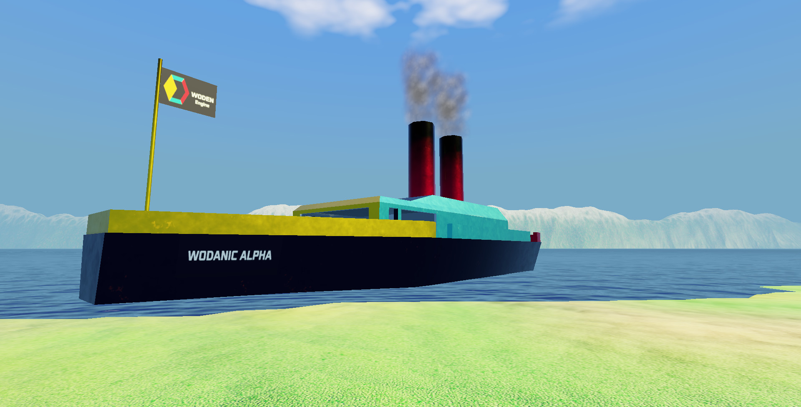

# Voyage in the WODANIC ALPHA
### Episode 0.01: A mysterious awakening in the volcanic Lake Wallen.

## Introduction to the **WODANIC ALPHA**
For an introduction to the **WODANIC ALPHA**, watch the following advertising
video:

## Technical specs of the **WODANIC ALPHA**

The **WODANIC ALPHA** is a state of the art steam powered compact sized ship for expeditions in remote areas. This ship boasts the following ground breaking
features:

1. Two coal powered boilers without emission filtering.
2. A single spacious control cabin.
3. A **WODEX Alto** based steering control system and indication dashboard.
4. The internal CPU and OS of the ship is programmed in a **SMALLTALK** of
    the Pharo brand.

The stains of rust on the surface are a feature, not a bug in the design of
this boat.

## Parent companies

* The ship building and servicing company is located in <https://github.com/woden-engine/woden-esug-2019-demo>.
* The holding and insurance company is located in <https://github.com/woden-engine/woden>.

## Ship direct sales

Direct sales of the ship are available in the following continents:

* Mac OS X: Coming soon.
* Linux: Coming soon.
* Windows: Coming soon.

-------
Jokes aside, this is the **Woden Engine Demo for ESUG 2019**
